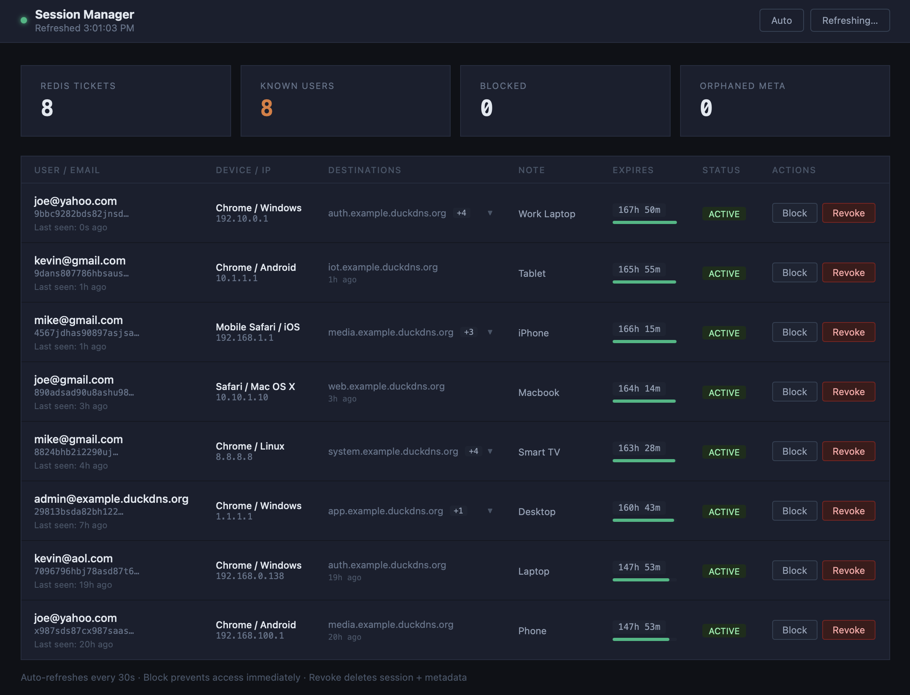

# oauth2-proxy-session-admin

A lightweight FastAPI service that provides a **web UI and REST API for managing oauth2-proxy sessions** stored in Redis.

Designed to work alongside [oauth2-proxy-authz](https://github.com/arm64buidz/oauth2-proxy-authz), [Pocket-ID](https://github.com/pocket-id/pocket-id), and oauth2-proxy as part of a self-hosted SSO stack.

---

## Dashboard



## What it does

oauth2-proxy stores session tokens in Redis but provides no built-in visibility into who is currently logged in or any way to revoke a session without flushing all of Redis. This service fills that gap.

It pairs with `oauth2-proxy-authz`, which writes rich session metadata (user, email, IP, browser, last-seen service) to Redis on every authorized request. This service reads that metadata and exposes it through a protected admin dashboard.

From the dashboard, an administrator can:

- See all active sessions with user details, IP, device, expiry, and which services they've accessed
- **Revoke a session** — deletes the session ticket from Redis, logging the user out immediately
- **Block a user** — adds the user's ID to a Redis blocklist, causing `authz` to return `403` on their next request (within 5 seconds, due to the blocklist cache TTL)
- **Unblock a user** — removes them from the blocklist
- **Add a note** to a session for administrative reference

---

## Architecture overview

```
Browser (admin user)
  │
  ▼
Traefik ──► oauth2-auth middleware   (must be authenticated)
         ──► authz-group-admin       (must be in 'administrator' group)
  │
  ▼
session-admin :8080
  │
  ├── GET  /admin-portal             → serves the web UI
  ├── GET  /api/sessions             → list all active sessions
  ├── GET  /api/stats                → aggregate stats
  ├── DELETE /api/sessions/{handle}  → revoke a session
  ├── POST   /api/sessions/{handle}/block    → block a user
  ├── DELETE /api/sessions/{handle}/block    → unblock a user
  └── POST   /api/sessions/{handle}/note     → set a note
```

The admin portal itself is protected by Traefik — only users with the `administrator` group in Pocket-ID can reach it. The service does not perform its own authentication.

---

## Environment variables

| Variable | Default | Description |
|---|---|---|
| `REDIS_URL` | `redis://redis:6379` | Connection URL for the shared Redis instance |
| `SESSION_PREFIX` | `_oauth2_proxy-` | Key prefix oauth2-proxy uses for session tickets in Redis. Must match your oauth2-proxy config |
| `CORS_ORIGINS` | `*` | Comma-separated list of allowed CORS origins for the API. Set this to your auth domain (e.g. `https://auth.example.duckdns.org`) in production |
| `META_TTL` | `604800` | TTL in seconds applied to orphaned metadata keys. Should match the value used in `oauth2-proxy-authz` |

---

## Redis key layout

This service reads keys written by `oauth2-proxy-authz` and the raw session keys written by oauth2-proxy itself. It does not write any new keys except when revoking or blocking.

| Key pattern | Type | Written by | Description |
|---|---|---|---|
| `_oauth2_proxy-<handle>` | string | oauth2-proxy | The live session ticket. Deleting this logs the user out |
| `session_meta:<handle>` | hash | authz | User ID, email, IP, device, last-seen timestamp, note |
| `session_destinations:<handle>` | hash | authz | Map of `destination → last_seen` for services visited |
| `user_sessions:<user_id>` | set | authz | All known handles for a given user |
| `blocklist:<user_id>` | string | session-admin | Exists if the user is blocked; no TTL (permanent until removed) |

---

## API reference

### `GET /api/sessions`

Returns a list of all sessions with metadata, sorted by most recently active.

**Response fields per session:**

| Field | Description |
|---|---|
| `handle` | Session ticket handle (used as the ID in other endpoints) |
| `user_id` | User identifier from the OIDC token |
| `email` | User's email address |
| `ip` | IP address at last request |
| `device` | Browser and OS at last request (e.g. `Chrome / Windows`) |
| `destinations` | Array of `{destination, last_seen}` — services the user has visited |
| `note` | Admin-set note, if any |
| `last_seen` | ISO 8601 timestamp of the most recent authorized request |
| `ttl_seconds` | Remaining TTL on the session ticket |
| `expires_in` | Human-readable TTL (e.g. `23h 14m`) |
| `blocked` | `true` if this user is on the blocklist |

---

### `GET /api/stats`

Returns aggregate counts across all sessions.

```json
{
  "total_tickets": 12,
  "known_users": 10,
  "blocked_users": 1,
  "orphaned_meta": 2
}
```

`orphaned_meta` is the number of metadata records whose underlying session ticket no longer exists in Redis (the session has expired or been revoked but the authz cleanup hasn't run yet).

---

### `DELETE /api/sessions/{handle}`

Revokes a session immediately by deleting the session ticket and all associated metadata from Redis. The user will be logged out on their next request.

---

### `POST /api/sessions/{handle}/block`

Adds the user associated with this session to the Redis blocklist. The block is permanent — it does not expire. The user will receive a `403 Forbidden` response on their next authorized request (within `BLOCKLIST_CACHE_TTL` seconds of the block being set).

---

### `DELETE /api/sessions/{handle}/block`

Removes the user associated with this session from the blocklist.

---

### `POST /api/sessions/{handle}/note`

Sets an administrative note on a session. Accepts a JSON body:

```json
{ "note": "Investigated 2026-06-25 — confirmed legit" }
```

Notes are capped at 500 characters and persist until the session metadata is deleted.

---

### `GET /admin-portal`

Serves the web UI (`index.html`). This is the route Traefik points browsers to.

### `GET /healthz`

Health check endpoint. Returns `{"status": "ok"}` if Redis is reachable. Used by container orchestration.

---

## Docker

```yaml
session-admin:
  image: arm64buidz/oauth2-proxy-session-admin:2026.6
  environment:
    - REDIS_URL=redis://oauth2-proxy-redis:6379
    - SESSION_PREFIX=_oauth2_proxy-
    - CORS_ORIGINS=https://auth.example.duckdns.org
  networks:
    - proxy-auth
  depends_on:
    - oauth2-proxy-redis
  restart: unless-stopped
```

The service exposes port `8080` internally. Traefik handles TLS termination and access control — this service does not need to be published directly.

### Traefik routing example

The admin portal routes require two middlewares: one for authentication (oauth2-proxy) and one for group-based authorization (authz). The higher priority ensures these routes are matched before the catch-all pocket-id router.

```yaml
routers:
  session_admin_router:
    rule: "Host(`auth.example.duckdns.org`) && (PathPrefix(`/admin-portal`) || PathPrefix(`/api/sessions`) || PathPrefix(`/api/stats`))"
    service: session_admin_service
    priority: 250
    middlewares:
      - oauth2-auth
      - authz-group-admin
    entryPoints:
      - https
    tls:
      certResolver: duckdnsresolver

services:
  session_admin_service:
    loadBalancer:
      servers:
        - url: http://session-admin:8080
```

---

## Related projects

- **[oauth2-proxy-authz](https://github.com/arm64buidz/oauth2-proxy-authz)** — companion service that writes the session metadata this dashboard reads, and enforces group-based access control
- **[oauth2-proxy](https://github.com/oauth2-proxy/oauth2-proxy)** — the authentication layer this service extends
- **[Pocket-ID](https://github.com/pocket-id/pocket-id)** — the OIDC identity provider used in the reference stack

For a full working example including Traefik config, docker-compose, and .env template, see the reference stack repository.
